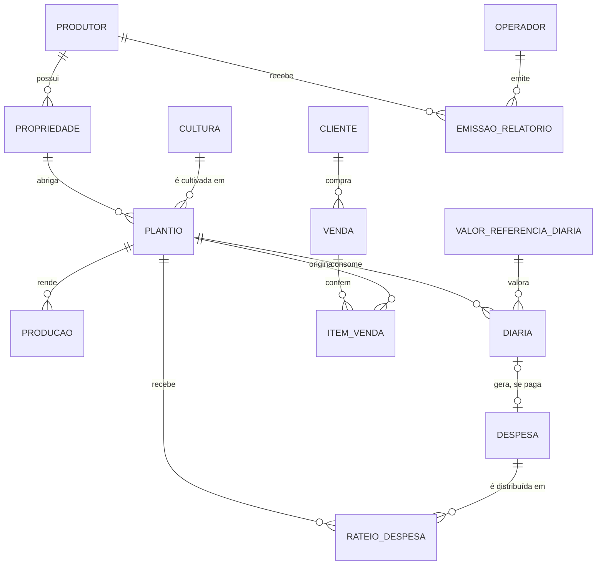

# AgroGestão — Fase 1: Modelo Conceitual de Dados (MER)

Versão 1.4

Modelo conceitual das entidades do domínio e seus relacionamentos. Deriva diretamente do glossário; nomes de entidade e de atributo seguem os termos ali definidos.

**Este documento não é o DER.** Não trata de tipos, índices, chaves físicas nem migrations. Define o que existe no domínio e como se relaciona.

**Documentos relacionados**

- `agrogestao-fase-1-glossario.md` — definição dos termos usados aqui
- `agrogestao-fase-2-padroes-tecnicos.md` — seção 2.5, convenções do modelo físico
- `agrogestao-validacoes-indice.md` — decisões que originam as cardinalidades

---

## 1. Diagrama

Entidades de apoio — `OPERADOR`, `PERFIL` — aparecem apenas onde relevantes ao domínio. Autenticação é tratada nos requisitos, não aqui.

---

## 2. Entidades

### PRODUTOR

Agricultor familiar associado. Não é usuário do sistema.

Atributos conceituais: nome, documento de identificação, endereço, profissão, contato.

> Endereço e profissão constam da especificação do relatório. Ficam no produtor, não no relatório — o documento os lê, não os armazena.

### PROPRIEDADE

Área rural do produtor. Um produtor pode ter mais de uma; cada propriedade pertence a um único produtor.

Atributos: nome ou identificação, área total, localização.

### CULTURA

Catálogo de espécies: milho, feijão, fava, banana, castanha, caju, mandioca, urucum, hortaliça. Entidade de referência, cadastrada uma vez e reutilizada.

Atributos: nome, tipo de ciclo (curto ou longo), unidade de medida padrão.

O tipo de ciclo aqui é o **padrão da espécie**. O plantio pode sobrepor esse valor se o caso concreto exigir.

### PLANTIO

Instância concreta de cultivo — uma cultura, em uma propriedade, numa área, com data de início. **É a unidade de custo e de apuração.**

Atributos: área utilizada, data de início, previsão de colheita, data de encerramento, tipo de ciclo efetivo.

A área é o atributo mais crítico do modelo: é ela que determina o rateio de despesa (`DA01`).

### PRODUCAO

Colheita registrada em um plantio. Um plantio de ciclo curto tem vários registros; um de ciclo longo, normalmente um.

Atributos: quantidade, unidade de medida, data do fato, data de coleta.

### DESPESA

Saída efetiva de dinheiro. **Não pertence a um plantio** — pertence ao produtor e é distribuída entre plantios pelo rateio.

Atributos: descrição, categoria, valor total, data do fato, data de coleta.

### RATEIO_DESPESA

Entidade associativa entre despesa e plantio. Existe porque `DA01` decidiu que uma despesa pode atender vários plantios, proporcionalmente à área.

Atributos: percentual aplicado, valor rateado.

> **O percentual é gravado, não calculado na consulta.** Corrigir a área de um plantio depois não altera rateios já realizados. Sem isso, um relatório reemitido meses adiante deixa de bater com o que foi entregue ao produtor — inaceitável para documento destinado a comprovação.

### DIARIA

Dia de trabalho em um plantio.

Atributos: data do fato, data de coleta, quantidade de dias, natureza (paga ou familiar), valor unitário aplicado.

O **valor unitário é gravado no registro** no momento do lançamento, mesmo quando vem da referência (`DA07`).

Diária de natureza **paga** origina automaticamente uma `DESPESA` vinculada, com rateio integral ao plantio da diária (`M01`). Diária **familiar** não gera despesa: não há desembolso.

### VALOR_REFERENCIA_DIARIA

Valor da diária praticada na região, cadastrado pelo operador com vigência por período.

Atributos: valor, data de início de vigência, data de fim de vigência.

Serve de origem para o valor da diária familiar. Atualizar a referência não altera registros passados, porque o valor já foi copiado para o registro.

### VENDA

Transação comercial com um cliente, numa data. É o cabeçalho: não carrega produto nem quantidade.

Atributos: data do fato, data de coleta, valor total.

### ITEM_VENDA

Linha da venda. Cada item aponta para o plantio de onde o produto saiu.

Atributos: quantidade, unidade de medida, valor unitário, valor total.

É por aqui que a receita chega ao plantio e o resultado se torna apurável (`M02`, opção C).

### CLIENTE

Comprador. Comércio local, feira, CEASA, merenda escolar, cooperativa.

Atributos: nome, tipo de canal.

### EMISSAO_RELATORIO

Registro de cada relatório gerado e entregue. Existe por causa de `DA05`: o documento precisa ser datado e retido a longo prazo.

Atributos: data de emissão, período coberto, operador emissor, conteúdo apurado no momento da emissão.

> Sem esta entidade o sistema não consegue responder "o que foi entregue ao produtor em março", que é justamente o que dá valor ao documento como registro contemporâneo.

---

## 3. Cardinalidades que exigiram decisão

| Relacionamento | Cardinalidade | Origem |
|---|---|---|
| Despesa ↔ Plantio | N:N, via `RATEIO_DESPESA` | `DA01` — rateio proporcional à área |
| Valor de referência → Diária | 1:N, com valor copiado | `DA07` — decisão da equipe |
| Venda ↔ Plantio | N:N, via `ITEM_VENDA` | `M02` — decisão da equipe |
| Cultura ↔ Plantio | 1:N | Glossário, seção 2 |
| Produtor ↔ Propriedade | 1:N | Glossário, seção 2 |

---

## 4. Decisões de modelagem

Pontos que o MER expõe e que precisam de definição antes do DER. São decisões técnicas da equipe, não de validação com o sindicato.

### M01 — Diária paga gera registro de despesa? — **DECIDIDA**

**Decisão: sim.** Diária de natureza paga origina uma `DESPESA` vinculada. O custo de desembolso passa a sair de uma fonte única — a soma das despesas rateadas ao plantio.

Três regras decorrentes, que precisam constar nas RN da Fase 1:

1. **A despesa é gerada pelo sistema**, não lançada à mão pelo operador. Exigir dois lançamentos manuais garante que uma hora falte um dos lados, e o custo fica errado sem sinal visível.
2. **Rateio integral.** A despesa gerada nasce com 100% para o plantio da diária. Se o mesmo diarista trabalhou em dois plantios, são duas diárias, cada uma com sua despesa.
3. **Vedação de dupla contagem.** O custo de desembolso soma apenas `DESPESA`. `DIARIA` nunca entra nesse total — participa somente do custo com mão de obra familiar, e apenas pelas de natureza familiar.

A terceira é a que produz erro silencioso se não for explicitada: somar diárias pagas nas duas pontas dobra o custo do plantio sem que nada pareça quebrado.

### M02 — Como a receita chega ao plantio — **DECIDIDA**

**Decisão: venda com itens (opção C).** `VENDA` guarda cliente e data; `ITEM_VENDA` guarda plantio, quantidade e valor.

Alternativas descartadas:

- **Venda apontando direto para um plantio.** Não representa o caso comum de o produtor levar milho e feijão à feira no mesmo dia, para o mesmo comprador — exigiria registrar duas vendas.
- **Venda apontando para o estoque, com o estoque sabendo a origem.** Descartada por dois motivos. O estoque é prioridade média no MVP e primeiro candidato a corte; ancorar a apuração de resultado nele faz o núcleo depender do dispensável. E o estoque não resolve a atribuição, apenas a adia: com dois plantios da mesma cultura, seria preciso estoque por lote, regra de baixa e saldo por lote. Como a produção é registrada de memória, o saldo não bate com a realidade, e o sistema passaria a bloquear vendas que de fato ocorreram.

A estrutura é a mesma adotada para despesa: uma transação alcançando vários plantios por meio de entidade associativa.

### M03 — Estoque é entidade ou saldo calculado? — **DECIDIDA**

**Decisão: saldo calculado, sem entidade própria.** O disponível de um plantio é a produção registrada menos o que saiu em `ITEM_VENDA`.

Com `M02` decidida, o estoque deixou de participar da apuração de resultado — ficou isolado do núcleo, o que torna a entidade dispensável. Estoque como tabela só se justificaria com perda, consumo próprio ou ajuste manual, nenhum deles no escopo.

**Reavaliar se surgir registro de perda ou de consumo próprio.** Ambos são plausíveis num segundo ciclo: metade dos associados produz para subsistência, e o que é consumido pela família sai do disponível sem gerar venda.

### M04 — Receita é entidade separada de venda? — **DECIDIDA**

**Decisão: não criar entidade `RECEITA`.** No MVP toda entrada de dinheiro vem de venda. A receita de um plantio é a soma dos `ITEM_VENDA` que o referenciam.

O termo permanece no glossário como conceito de apuração, sem correspondência no modelo. Se surgir entrada não originada de venda registrada, a entidade entra então.

---

## 5. Entidades resultantes

Com M01 a M04 decididas, o modelo conceitual fecha com nove entidades de domínio:

| Entidade | Papel |
|---|---|
| `PRODUTOR` | Beneficiário; não é usuário |
| `PROPRIEDADE` | Área rural do produtor |
| `CULTURA` | Catálogo de espécies |
| `PLANTIO` | Unidade de custo e de apuração |
| `PRODUCAO` | Colheita registrada |
| `DESPESA` | Desembolso efetivo |
| `RATEIO_DESPESA` | Distribuição da despesa entre plantios |
| `DIARIA` | Dia de trabalho, pago ou familiar |
| `VALOR_REFERENCIA_DIARIA` | Referência regional, com vigência |
| `VENDA` | Transação com cliente |
| `ITEM_VENDA` | Linha da venda, ligada ao plantio |
| `CLIENTE` | Comprador |
| `EMISSAO_RELATORIO` | Registro datado de cada relatório entregue |

Não existem no modelo, por decisão explícita: `ESTOQUE` (M03) e `RECEITA` (M04).

---

## 6. Separação entre Cultura e Plantio — confirmada

A separação está decidida. `CULTURA` é catálogo de espécie; `PLANTIO` é o cultivo concreto e a unidade de custo. Cinco entidades se ancoram nele: `PRODUCAO`, `DIARIA`, `RATEIO_DESPESA`, `ITEM_VENDA` e a apuração de resultado.

Justificativa registrada no glossário, seção 2.

**O nome está confirmado:** `PLANTIO`. As alternativas consideradas e o motivo do descarte estão registrados no glossário, seção 2.

O modelo conceitual está fechado. O DER pode ser desenhado a partir dele.
