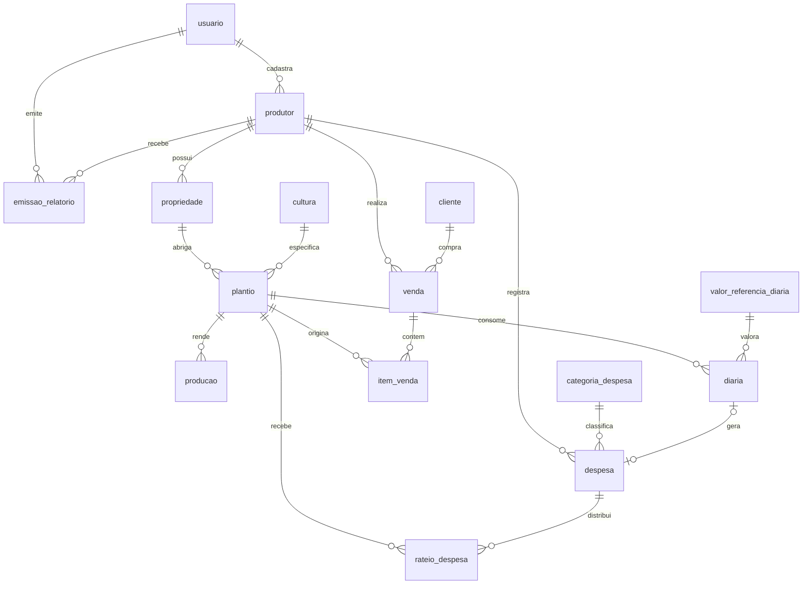

# AgroGestão — Fase 2: Modelo Físico de Dados (DER)

Versão 1.1

Modelo físico para PostgreSQL, derivado do MER conceitual. Segue as convenções da seção 2.5 dos padrões técnicos: tabelas em snake_case singular, chave primária `id`, estrangeira `<tabela>_id`, colunas de auditoria em todas as tabelas, valores monetários em `NUMERIC`.

**Documentos relacionados**

- `agrogestao-fase-1-mer.md` — entidades e decisões de modelagem
- `agrogestao-fase-1-regras-negocio.md` — as regras que este modelo precisa sustentar
- `agrogestao-fase-2-padroes-tecnicos.md` — convenções de nomenclatura e migrations

---

## 1. Diagrama



---

## 2. Convenções aplicadas a todas as tabelas

```sql
id             BIGSERIAL PRIMARY KEY,
criado_em      TIMESTAMPTZ  NOT NULL DEFAULT now(),
atualizado_em  TIMESTAMPTZ  NOT NULL DEFAULT now(),
criado_por     BIGINT       NOT NULL REFERENCES usuario(id)
```

`criado_por` não é opcional. Com titular e suplente lançando dados, é o que permite investigar inconsistência (`R4`).

Valores monetários: `NUMERIC(12,2)`. Quantidades: `NUMERIC(12,3)`, porque produção em quilos admite fração.

---

## 3. Tabelas

### usuario

```sql
CREATE TABLE usuario (
    id             BIGSERIAL PRIMARY KEY,
    nome           VARCHAR(150) NOT NULL,
    login          VARCHAR(100) NOT NULL UNIQUE,
    senha_hash     VARCHAR(255) NOT NULL,
    perfil         VARCHAR(20)  NOT NULL,
    ativo          BOOLEAN      NOT NULL DEFAULT TRUE,
    criado_em      TIMESTAMPTZ  NOT NULL DEFAULT now(),
    atualizado_em  TIMESTAMPTZ  NOT NULL DEFAULT now(),
    CONSTRAINT ck_usuario_perfil CHECK (perfil IN ('LANCAMENTO','CONSULTA','ADMIN'))
);
```

Sem `criado_por` — é a raiz da cadeia de auditoria.

### produtor

```sql
CREATE TABLE produtor (
    id                BIGSERIAL PRIMARY KEY,
    nome              VARCHAR(150) NOT NULL,
    documento         CHAR(11)     NOT NULL UNIQUE,
    endereco          VARCHAR(255),
    profissao         VARCHAR(100),
    contato           VARCHAR(100),
    consentimento_em  DATE,
    ativo             BOOLEAN      NOT NULL DEFAULT TRUE,
    criado_em         TIMESTAMPTZ  NOT NULL DEFAULT now(),
    atualizado_em     TIMESTAMPTZ  NOT NULL DEFAULT now(),
    criado_por        BIGINT       NOT NULL REFERENCES usuario(id)
);
CREATE INDEX idx_produtor_nome ON produtor (nome);
```

`consentimento_em` nulo significa consentimento não registrado. A `RN37` bloqueia emissão de relatório nesse caso, não o lançamento.

`ativo` sustenta a `RF09`: produtor com lançamentos é inativado, nunca excluído.

`documento` é o CPF, armazenado apenas com os dígitos, sem máscara. A formatação é responsabilidade da interface.

### propriedade

```sql
CREATE TABLE propriedade (
    id             BIGSERIAL PRIMARY KEY,
    produtor_id    BIGINT       NOT NULL REFERENCES produtor(id),
    nome           VARCHAR(150) NOT NULL,
    area_total     NUMERIC(12,3),
    localizacao    VARCHAR(255),
    criado_em      TIMESTAMPTZ  NOT NULL DEFAULT now(),
    atualizado_em  TIMESTAMPTZ  NOT NULL DEFAULT now(),
    criado_por     BIGINT       NOT NULL REFERENCES usuario(id)
);
CREATE INDEX idx_propriedade_produtor_id ON propriedade (produtor_id);
```

### cultura

```sql
CREATE TABLE cultura (
    id                 BIGSERIAL PRIMARY KEY,
    nome               VARCHAR(100) NOT NULL UNIQUE,
    tipo_ciclo_padrao  VARCHAR(10)  NOT NULL,
    unidade_medida     VARCHAR(10)  NOT NULL,
    criado_em          TIMESTAMPTZ  NOT NULL DEFAULT now(),
    atualizado_em      TIMESTAMPTZ  NOT NULL DEFAULT now(),
    criado_por         BIGINT       NOT NULL REFERENCES usuario(id),
    CONSTRAINT ck_cultura_ciclo CHECK (tipo_ciclo_padrao IN ('CURTO','LONGO'))
);
```

### plantio

```sql
CREATE TABLE plantio (
    id                  BIGSERIAL PRIMARY KEY,
    propriedade_id      BIGINT       NOT NULL REFERENCES propriedade(id),
    cultura_id          BIGINT       NOT NULL REFERENCES cultura(id),
    area                NUMERIC(12,3) NOT NULL,
    tipo_ciclo          VARCHAR(10)  NOT NULL,
    data_inicio         DATE         NOT NULL,
    previsao_colheita   DATE,
    data_encerramento   DATE,
    criado_em           TIMESTAMPTZ  NOT NULL DEFAULT now(),
    atualizado_em       TIMESTAMPTZ  NOT NULL DEFAULT now(),
    criado_por          BIGINT       NOT NULL REFERENCES usuario(id),
    CONSTRAINT ck_plantio_area      CHECK (area > 0),
    CONSTRAINT ck_plantio_ciclo     CHECK (tipo_ciclo IN ('CURTO','LONGO')),
    CONSTRAINT ck_plantio_encerra   CHECK (data_encerramento IS NULL
                                           OR data_encerramento >= data_inicio)
);
CREATE INDEX idx_plantio_propriedade_id ON plantio (propriedade_id);
CREATE INDEX idx_plantio_cultura_id     ON plantio (cultura_id);
```

`ck_plantio_area` é a `RN01` no banco, não só no serviço. Área zero tornaria o rateio indefinido — vale proteger nas duas camadas.

`tipo_ciclo` é copiado da cultura no cadastro e pode ser sobreposto (`RF12`).

### producao

```sql
CREATE TABLE producao (
    id              BIGSERIAL PRIMARY KEY,
    plantio_id      BIGINT        NOT NULL REFERENCES plantio(id),
    quantidade      NUMERIC(12,3) NOT NULL,
    unidade_medida  VARCHAR(10)   NOT NULL,
    data_fato       DATE          NOT NULL,
    data_coleta     DATE          NOT NULL,
    criado_em       TIMESTAMPTZ   NOT NULL DEFAULT now(),
    atualizado_em   TIMESTAMPTZ   NOT NULL DEFAULT now(),
    criado_por      BIGINT        NOT NULL REFERENCES usuario(id),
    CONSTRAINT ck_producao_qtd CHECK (quantidade > 0)
);
CREATE INDEX idx_producao_plantio_id ON producao (plantio_id, data_fato);
```

### categoria_despesa

```sql
CREATE TABLE categoria_despesa (
    id             BIGSERIAL PRIMARY KEY,
    nome           VARCHAR(80) NOT NULL UNIQUE,
    sistema        BOOLEAN     NOT NULL DEFAULT FALSE,
    criado_em      TIMESTAMPTZ NOT NULL DEFAULT now(),
    atualizado_em  TIMESTAMPTZ NOT NULL DEFAULT now(),
    criado_por     BIGINT      NOT NULL REFERENCES usuario(id)
);
```

`sistema = TRUE` marca a categoria "Diária", criada por migration e não removível pelo operador — a `RN16` depende dela existir.

### despesa

```sql
CREATE TABLE despesa (
    id                    BIGSERIAL PRIMARY KEY,
    produtor_id           BIGINT        NOT NULL REFERENCES produtor(id),
    categoria_despesa_id  BIGINT        NOT NULL REFERENCES categoria_despesa(id),
    diaria_id             BIGINT        UNIQUE REFERENCES diaria(id),
    descricao             VARCHAR(255)  NOT NULL,
    valor_total           NUMERIC(12,2) NOT NULL,
    data_fato             DATE          NOT NULL,
    data_coleta           DATE          NOT NULL,
    estornada             BOOLEAN       NOT NULL DEFAULT FALSE,
    criado_em             TIMESTAMPTZ   NOT NULL DEFAULT now(),
    atualizado_em         TIMESTAMPTZ   NOT NULL DEFAULT now(),
    criado_por            BIGINT        NOT NULL REFERENCES usuario(id),
    CONSTRAINT ck_despesa_valor CHECK (valor_total > 0)
);
CREATE INDEX idx_despesa_produtor_id ON despesa (produtor_id, data_fato);
```

`diaria_id` é a ligação da `RN16`. Nulo na despesa comum; preenchido e único na despesa gerada por diária paga — uma diária gera no máximo uma despesa.

`estornada` atende a `RN11`: despesa já incluída em relatório emitido não é excluída, é estornada.

### rateio_despesa

```sql
CREATE TABLE rateio_despesa (
    id             BIGSERIAL PRIMARY KEY,
    despesa_id     BIGINT        NOT NULL REFERENCES despesa(id) ON DELETE CASCADE,
    plantio_id     BIGINT        NOT NULL REFERENCES plantio(id),
    percentual     NUMERIC(9,6)  NOT NULL,
    valor_rateado  NUMERIC(12,2) NOT NULL,
    criado_em      TIMESTAMPTZ   NOT NULL DEFAULT now(),
    atualizado_em  TIMESTAMPTZ   NOT NULL DEFAULT now(),
    criado_por     BIGINT        NOT NULL REFERENCES usuario(id),
    CONSTRAINT uk_rateio_despesa_plantio UNIQUE (despesa_id, plantio_id),
    CONSTRAINT ck_rateio_percentual CHECK (percentual > 0 AND percentual <= 1)
);
CREATE INDEX idx_rateio_despesa_plantio_id ON rateio_despesa (plantio_id);
```

**`valor_rateado` é a fonte de verdade da apuração, não o percentual.** A `RN09` garante que a soma dos valores rateados seja exatamente o valor da despesa; recalcular a partir do percentual reintroduz o centavo perdido.

`ON DELETE CASCADE` implementa a `RN11`: excluir despesa remove seus rateios.

### valor_referencia_diaria

```sql
CREATE EXTENSION IF NOT EXISTS btree_gist;

CREATE TABLE valor_referencia_diaria (
    id              BIGSERIAL PRIMARY KEY,
    valor           NUMERIC(12,2) NOT NULL,
    vigencia_inicio DATE          NOT NULL,
    vigencia_fim    DATE,
    criado_em       TIMESTAMPTZ   NOT NULL DEFAULT now(),
    atualizado_em   TIMESTAMPTZ   NOT NULL DEFAULT now(),
    criado_por      BIGINT        NOT NULL REFERENCES usuario(id),
    CONSTRAINT ck_vrd_valor CHECK (valor > 0),
    CONSTRAINT ex_vrd_vigencia EXCLUDE USING gist (
        daterange(vigencia_inicio, COALESCE(vigencia_fim, 'infinity'::date), '[]')
        WITH &&
    )
);
```

A restrição `EXCLUDE` implementa a `RN17` no banco: períodos de vigência não podem se sobrepor. Validar só no serviço deixaria brecha para requisição concorrente gravar duas vigências conflitantes.

Exige a extensão `btree_gist`, criada na mesma migration.

### diaria

```sql
CREATE TABLE diaria (
    id                          BIGSERIAL PRIMARY KEY,
    plantio_id                  BIGINT        NOT NULL REFERENCES plantio(id),
    valor_referencia_diaria_id  BIGINT        REFERENCES valor_referencia_diaria(id),
    natureza                    VARCHAR(10)   NOT NULL,
    quantidade_dias             NUMERIC(6,2)  NOT NULL,
    valor_unitario              NUMERIC(12,2) NOT NULL,
    data_fato                   DATE          NOT NULL,
    data_coleta                 DATE          NOT NULL,
    criado_em                   TIMESTAMPTZ   NOT NULL DEFAULT now(),
    atualizado_em               TIMESTAMPTZ   NOT NULL DEFAULT now(),
    criado_por                  BIGINT        NOT NULL REFERENCES usuario(id),
    CONSTRAINT ck_diaria_natureza CHECK (natureza IN ('PAGA','FAMILIAR')),
    CONSTRAINT ck_diaria_qtd      CHECK (quantidade_dias > 0),
    CONSTRAINT ck_diaria_valor    CHECK (valor_unitario > 0),
    CONSTRAINT ck_diaria_ref      CHECK (
        (natureza = 'FAMILIAR' AND valor_referencia_diaria_id IS NOT NULL)
        OR natureza = 'PAGA'
    )
);
CREATE INDEX idx_diaria_plantio_id ON diaria (plantio_id, data_fato);
```

`valor_unitario` é sempre gravado, em ambas as naturezas. Na familiar vem da referência vigente (`RN13`); na paga é informado (`RN15`). A referência fica guardada por rastreabilidade, mas o valor da apuração é o da coluna — por isso alterar a referência depois não retroage (`RN18`).

### cliente

```sql
CREATE TABLE cliente (
    id             BIGSERIAL PRIMARY KEY,
    nome           VARCHAR(150) NOT NULL,
    tipo_canal     VARCHAR(30)  NOT NULL,
    criado_em      TIMESTAMPTZ  NOT NULL DEFAULT now(),
    atualizado_em  TIMESTAMPTZ  NOT NULL DEFAULT now(),
    criado_por     BIGINT       NOT NULL REFERENCES usuario(id),
    CONSTRAINT ck_cliente_canal CHECK (tipo_canal IN
        ('COMERCIO','FEIRA','CEASA','MERENDA','COOPERATIVA','OUTRO'))
);
```

Os canais vêm da resposta de `DA04`.

### venda

```sql
CREATE TABLE venda (
    id             BIGSERIAL PRIMARY KEY,
    produtor_id    BIGINT        NOT NULL REFERENCES produtor(id),
    cliente_id     BIGINT        NOT NULL REFERENCES cliente(id),
    valor_total    NUMERIC(12,2) NOT NULL,
    data_fato      DATE          NOT NULL,
    data_coleta    DATE          NOT NULL,
    criado_em      TIMESTAMPTZ   NOT NULL DEFAULT now(),
    atualizado_em  TIMESTAMPTZ   NOT NULL DEFAULT now(),
    criado_por     BIGINT        NOT NULL REFERENCES usuario(id)
);
CREATE INDEX idx_venda_produtor_id ON venda (produtor_id, data_fato);
```

### item_venda

```sql
CREATE TABLE item_venda (
    id              BIGSERIAL PRIMARY KEY,
    venda_id        BIGINT        NOT NULL REFERENCES venda(id) ON DELETE CASCADE,
    plantio_id      BIGINT        NOT NULL REFERENCES plantio(id),
    quantidade      NUMERIC(12,3) NOT NULL,
    unidade_medida  VARCHAR(10)   NOT NULL,
    valor_unitario  NUMERIC(12,2) NOT NULL,
    valor_total     NUMERIC(12,2) NOT NULL,
    criado_em       TIMESTAMPTZ   NOT NULL DEFAULT now(),
    atualizado_em   TIMESTAMPTZ   NOT NULL DEFAULT now(),
    criado_por      BIGINT        NOT NULL REFERENCES usuario(id),
    CONSTRAINT ck_item_venda_qtd   CHECK (quantidade > 0),
    CONSTRAINT ck_item_venda_valor CHECK (valor_total > 0)
);
CREATE INDEX idx_item_venda_plantio_id ON item_venda (plantio_id);
```

`idx_item_venda_plantio_id` sustenta a `RN22` — receita do plantio — e a `RN29` — saldo disponível.

### emissao_relatorio

```sql
CREATE TABLE emissao_relatorio (
    id               BIGSERIAL PRIMARY KEY,
    produtor_id      BIGINT      NOT NULL REFERENCES produtor(id),
    usuario_id       BIGINT      NOT NULL REFERENCES usuario(id),
    data_emissao     TIMESTAMPTZ NOT NULL DEFAULT now(),
    periodo_inicio   DATE        NOT NULL,
    periodo_fim      DATE        NOT NULL,
    conteudo         JSONB       NOT NULL,
    criado_em        TIMESTAMPTZ NOT NULL DEFAULT now(),
    atualizado_em    TIMESTAMPTZ NOT NULL DEFAULT now(),
    criado_por       BIGINT      NOT NULL REFERENCES usuario(id),
    CONSTRAINT ck_emissao_periodo CHECK (periodo_fim >= periodo_inicio)
);
CREATE INDEX idx_emissao_relatorio_produtor_id
    ON emissao_relatorio (produtor_id, data_emissao DESC);
```

**`conteudo` guarda o apurado no momento da emissão, não uma referência.** É o que sustenta a `RN34`: se o relatório referenciasse os lançamentos, qualquer correção posterior mudaria retroativamente o que foi entregue ao produtor — exatamente o que o uso probatório não admite.

Reemitir o mesmo período gera nova linha; a anterior permanece.

---

## 4. Ordem das migrations

Dependência de chave estrangeira impõe a sequência. `despesa` referencia `diaria` e `diaria` referencia `plantio`, então a coluna `diaria_id` em `despesa` entra depois da criação de `diaria`.

| Ordem | Migration | Conteúdo |
|---|---|---|
| 1 | `V<ts>__cria_extensoes.sql` | `btree_gist` |
| 2 | `V<ts>__cria_usuario.sql` | usuario |
| 3 | `V<ts>__cria_produtor_propriedade.sql` | produtor, propriedade |
| 4 | `V<ts>__cria_cultura_plantio.sql` | cultura, plantio |
| 5 | `V<ts>__cria_producao.sql` | producao |
| 6 | `V<ts>__cria_valor_referencia_diaria.sql` | valor_referencia_diaria |
| 7 | `V<ts>__cria_diaria.sql` | diaria |
| 8 | `V<ts>__cria_despesa_rateio.sql` | categoria_despesa, despesa, rateio_despesa |
| 9 | `V<ts>__cria_cliente_venda.sql` | cliente, venda, item_venda |
| 10 | `V<ts>__cria_emissao_relatorio.sql` | emissao_relatorio |
| 11 | `V<ts>__insere_dados_iniciais.sql` | usuário administrador inicial; categoria "Diária" com `sistema = TRUE`; catálogo inicial de culturas |

`<ts>` é o timestamp no formato `AAAAMMDD_HHMM`, conforme a seção 2.5 dos padrões técnicos. Numeração sequencial está vedada por causa de colisão em merge.

### Catálogo inicial de culturas

As culturas vêm das informadas pelo sindicato em VAL02. Unidade em quilo, exceto onde o produtor conta por unidade.

| Cultura | Ciclo | Unidade |
|---|---|---|
| Milho | Longo | kg |
| Feijão | Longo | kg |
| Fava | Longo | kg |
| Mandioca | Longo | kg |
| Urucum | Longo | kg |
| Castanha | Longo | kg |
| Caju | Longo | kg |
| Banana | Curto | kg |
| Hortaliça | Curto | kg |

O catálogo é editável pelo operador. Esta é a carga inicial, não uma lista fechada — nova cultura que apareça no atendimento é cadastrada na hora.

---

## 5. Regras que ficam no serviço, não no banco

Nem toda regra cabe em restrição declarativa. Estas ficam na camada de serviço, e por isso precisam de caso de teste explícito:

| Regra | Por que não no banco |
|---|---|
| RN04 — lançamento em plantio encerrado | Exige consultar a data de encerramento do plantio pai |
| RN07, RN09 — cálculo e fechamento de centavos | Cálculo entre várias linhas, em transação |
| RN16 — geração da despesa da diária | Orquestração de duas inserções |
| RN20 — vedação de dupla contagem | É regra de consulta, não de escrita |
| RN24 — período de apuração pelo ciclo | Lógica de derivação |
| RN29 — saldo não bloqueia venda | Ausência deliberada de restrição |
| RN37 — consentimento como condição para emissão | Depende de estado de outra tabela |

A RN29 merece nota: a **ausência** de restrição é decisão, não esquecimento. Ninguém deve acrescentar um `CHECK` de saldo depois achando que faltou.

---

## Sobre banana e caju

Ambas são perenes: o pé produz por anos, com colheitas recorrentes. Ficaram classificadas pelo comportamento de colheita, não pela botânica — banana como ciclo curto porque rende continuamente e apura por mês; caju e castanha como longo porque concentram a produção na safra.

Se na prática o produtor tratar alguma delas de outro jeito, o plantio sobrepõe o ciclo padrão da cultura (`RF12`), sem precisar mexer no catálogo.
